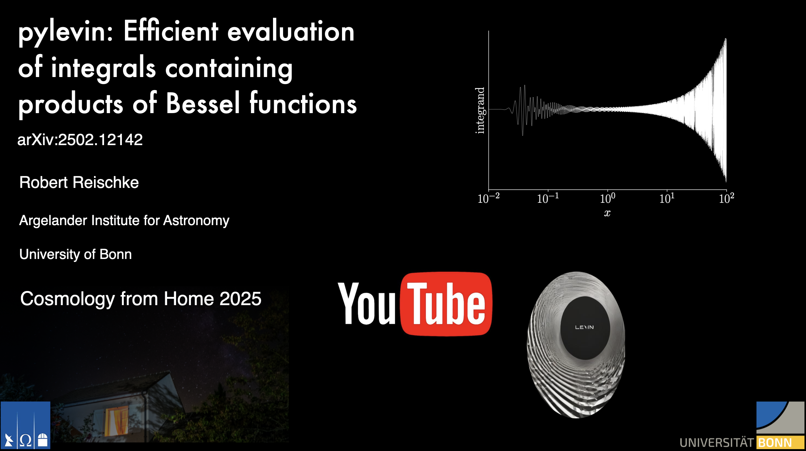

This library implements Levin's method for integrals containing products of up to three spherical or cylindrical Bessel functions.

## Installation
The installation has been tested on linux-based systems as well as Mac OS. For windows users, one would need to modify the ``setupy.py`` file accordingly. 
### With pip
The library is available via PyPi installation, so you can just install it using 
```shell
pip install pylevin
```
which installs the levin package and you are ready to go. Note that you need certain packages which you have to install via ``conda-forge``, in particular you will need the GSL, BOOST and GXX (on some linux servers) to be installed. You can grab them all via
```shell
conda install -c conda-forge gsl
conda install -c conda-forge gxx_linux-64
conda install conda-forge::boost
```
if they are not installed already.

### From source
Alternatively you first clone the directory via:
```shell
git clone git@github.com:rreischke/levin_bessel.git
```

Then navigate to the cloned directory
```shell
cd levin_bessel
conda env create -f conda_env.yaml
conda activate levin_env
pip install .
```
On some Linux servers you will have to install ``gxx_linux-64`` by hand and the installation will not work. This usually shows the following error message in the terminal:
``
gcc: fatal error: cannot execute 'cc1plus': execvp: No such file or directory
``
If this is the case just install it by typing
```shell
 conda install -c conda-forge gxx_linux-64
```
and redo the ``pip`` installation. 

### Testing the installation
You can run ``pytest`` to test the installation.


## Video-Tutorial: Cosmology from Home 2025 recording
Feel free to watch my recording for Cosmology from Home 2025 on YouTube for a brief tutorial and a general explanation of the method and summary of the corresponding paper.
[](https://www.youtube.com/watch?v=RcZVc6emnQU&t=2s)


## Tutorial: How to use the library
There is a detailed documentation of the code on [levin-bessel.readthedocs.io](https://levin-bessel.readthedocs.io/en/latest/). For a tutorial, there is a detailed [python notebook](https://github.com/rreischke/levin_bessel/blob/main/tutorial/levin_tutorial.ipynb) in the ``tutorial`` directory

## Contributing
If you want other types of oscillatory integrals implemented in ``pylevin``, I am very happy to help navigating the code. Note that these integrals need to satisfy some kind recursion relation for their derivatives (Eq. 9 in the arxiv version of the paper). This relation can technically be numerical but requires very stable derivatives.

## Reporting issues and support
If you encounter any issue or need help with the code you can either open an issue directly on github, or drop me a mail to reischke@posteo.net.


## Citing pylevin
If you use this code please cite the implementation described in [2502.12142](https://arxiv.org/abs/2502.12142). You can find references to the original method therein.

